# 🏗️ Diagrama Completo del Sistema — CRM Einsur Global

---

## 1. Arquitectura General del Sistema

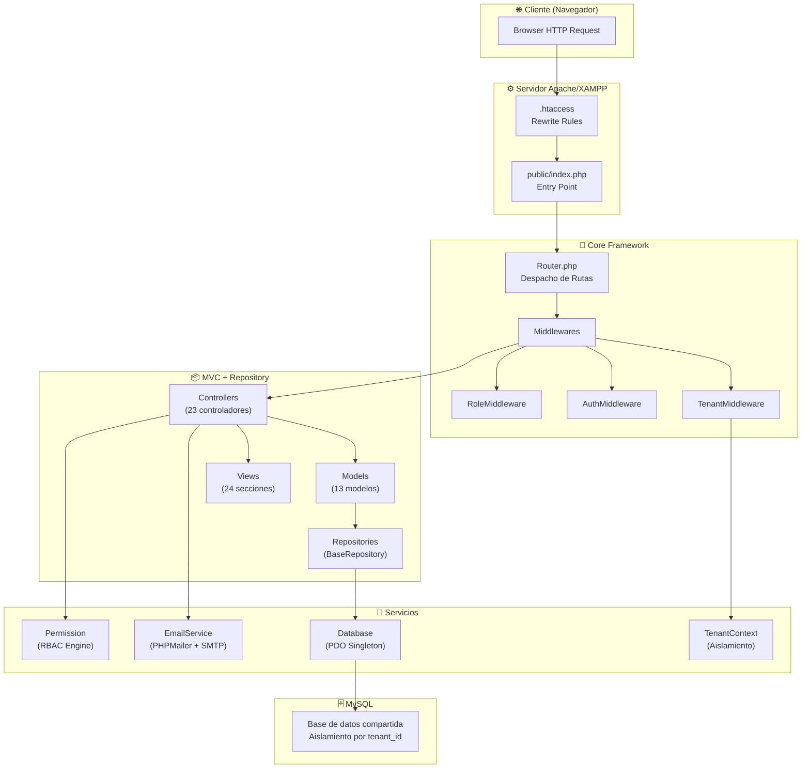

---

## 2. Flujo Completo de una Petición HTTP

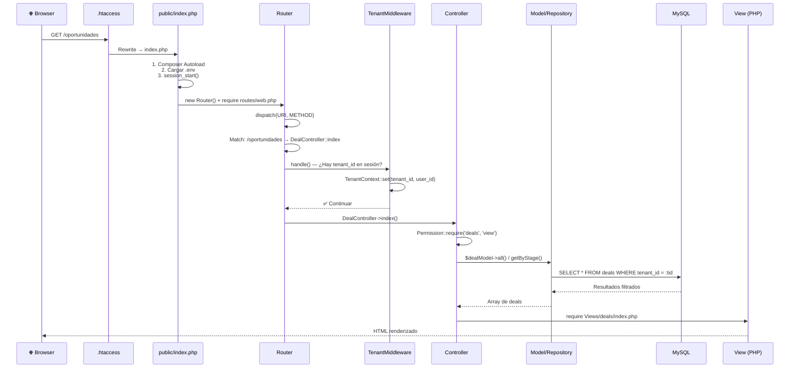

---

## 3. Sistema Multi-Tenant — Aislamiento de Datos

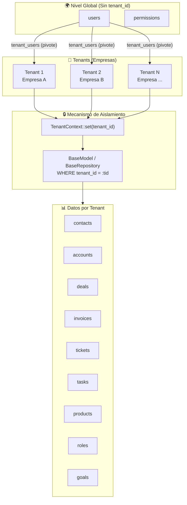

> [!IMPORTANT]
> **Todas las tablas operativas** incluyen una columna `tenant_id`. Las clases `BaseModel` y `BaseRepository` **inyectan automáticamente** el filtro `WHERE tenant_id = :tid` en cada consulta CRUD, haciendo imposible la fuga de datos entre empresas.

### Tabla Pivote `tenant_users`

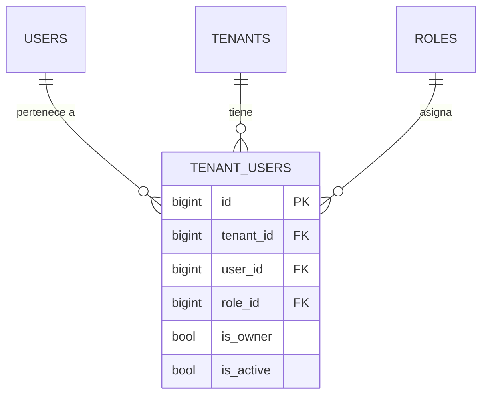

---

## 4. Sistema RBAC — Roles y Permisos

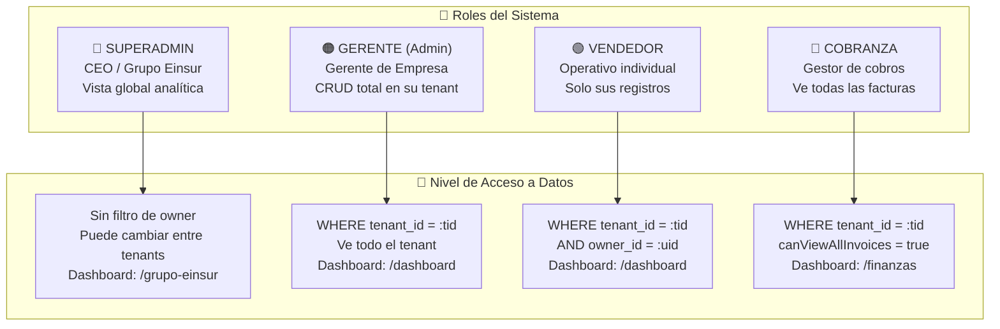

### Flujo de Decisión RBAC

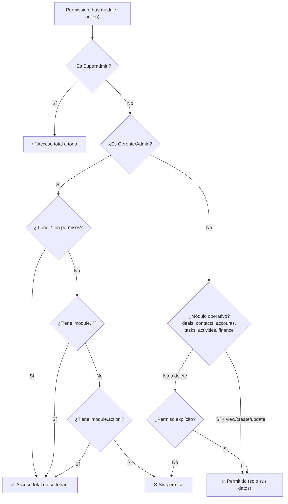

---

## 5. Diagrama Entidad-Relación (Base de Datos)

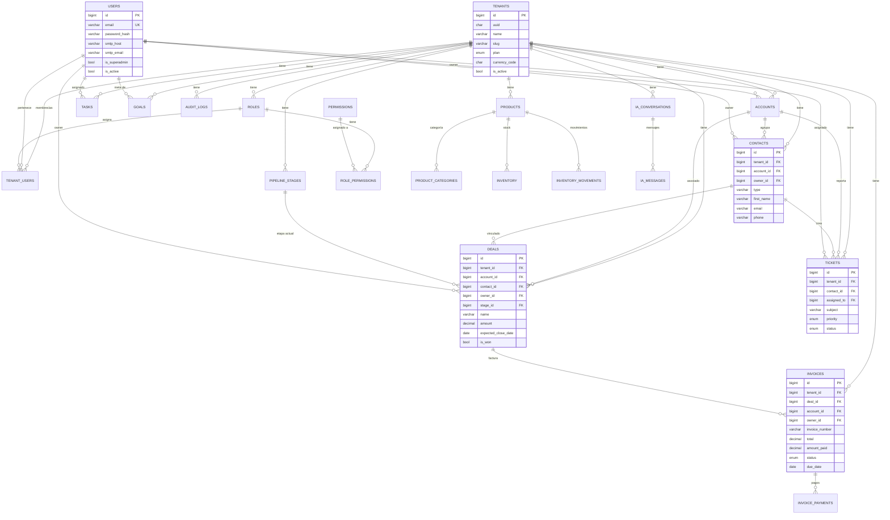

---

## 6. Mapa de Módulos y Controladores

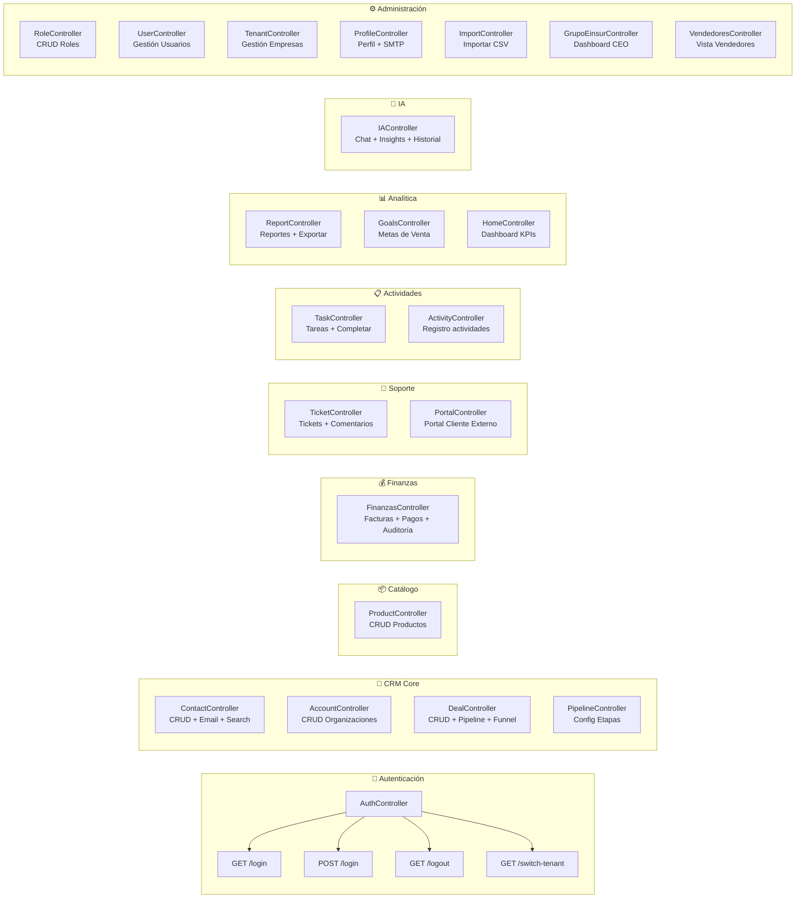

---

## 7. Pipeline de Ventas — Flujo de Negocio

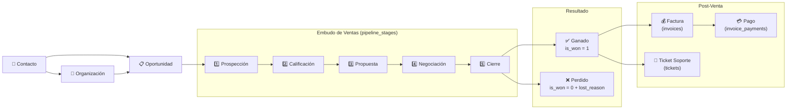

### Ciclo de Vida de una Factura

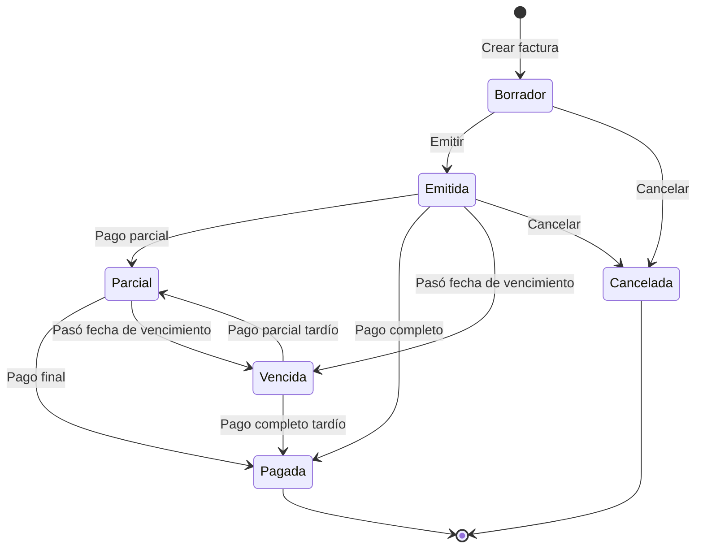

---

## 8. Portal de Clientes (Externo)

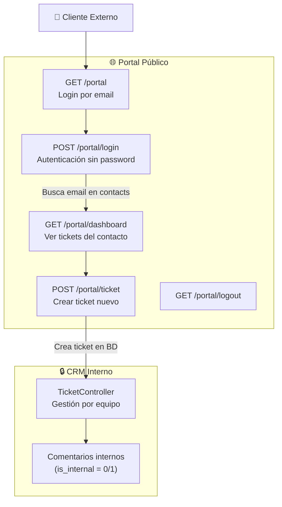

---

## 9. Estructura de Carpetas del Proyecto

```
crm_einsurglobal/
├── 📁 public/                    ← Document Root (Apache)
│   ├── index.php                 ← Entry Point único
│   ├── .htaccess                 ← Rewrite Rules
│   └── img/                      ← Assets estáticos
│
├── 📁 config/
│   ├── database.php              ← Conexión MySQL (PDO)
│   └── jwt.php                   ← Secreto JWT
│
├── 📁 routes/
│   └── web.php                   ← 70+ rutas (GET/POST)
│
├── 📁 src/
│   ├── 📁 Core/                  ← Framework propio
│   │   ├── Router.php            ← Despacho URI → Controller
│   │   ├── Database.php          ← PDO Singleton
│   │   ├── BaseModel.php         ← CRUD con tenant_id
│   │   ├── BaseRepository.php    ← CRUD avanzado + paginación
│   │   ├── TenantContext.php     ← Estado global del tenant
│   │   ├── Permission.php        ← Motor RBAC
│   │   ├── EmailService.php      ← PHPMailer SMTP
│   │   └── helpers.php           ← Funciones globales (url())
│   │
│   ├── 📁 Http/
│   │   ├── 📁 Controllers/       ← 23 controladores
│   │   │   ├── AuthController        ← Login/Logout/Switch
│   │   │   ├── HomeController        ← Dashboard KPIs
│   │   │   ├── ContactController     ← CRUD + Email + Search
│   │   │   ├── AccountController     ← CRUD Organizaciones
│   │   │   ├── DealController        ← CRUD + Pipeline
│   │   │   ├── FinanzasController    ← Facturas + Pagos + Auditoría
│   │   │   ├── TicketController      ← Soporte
│   │   │   ├── TaskController        ← Tareas
│   │   │   ├── ProductController     ← Catálogo
│   │   │   ├── ReportController      ← Reportes + Export
│   │   │   ├── IAController          ← Asistente IA
│   │   │   ├── GoalsController       ← Metas de venta
│   │   │   ├── ImportController      ← CSV Import
│   │   │   ├── PortalController      ← Portal clientes
│   │   │   ├── GrupoEinsurController ← Dashboard CEO
│   │   │   └── ...                   ← Roles, Users, Profile, etc.
│   │   │
│   │   └── 📁 Middleware/
│   │       ├── AuthMiddleware.php    ← JWT Bearer (API)
│   │       ├── TenantMiddleware.php  ← Sesión → TenantContext
│   │       └── RoleMiddleware.php    ← Guards por rol
│   │
│   ├── 📁 Models/                ← 13 modelos (extienden BaseModel)
│   │   ├── Account, Activity, AuditLog, Contact
│   │   ├── Deal, Invoice, PipelineStage, Product
│   │   ├── Role, Task, Tenant, Ticket, User
│   │
│   ├── 📁 Modules/              ← Patrón modular (Repository)
│   │   ├── Sales/Repositories/LeadRepository
│   │   ├── Sales/Services/LeadService
│   │   ├── Catalog/Repositories/
│   │   ├── Support/Repositories/
│   │   └── Activities/Repositories/
│   │
│   └── 📁 Views/                ← 24 secciones de vistas PHP
│       ├── auth/, dashboard/, contacts/, deals/
│       ├── finanzas/, tickets/, tasks/, products/
│       ├── reports/, roles/, users/, profile/
│       ├── empresas/, vendedores/, grupo_einsur/
│       ├── portal/, ia/, goals/, import/
│       ├── layouts/              ← Layout principal
│       └── partials/             ← Componentes reutilizables
│
├── 📁 database/                  ← 15 migraciones SQL
│   ├── 001_core_global.sql       ← tenants, users, roles, perms
│   ├── 002_sales_crm.sql        ← leads, accounts, contacts, deals
│   ├── 003_catalog_inventory.sql ← products, inventory
│   ├── 004_support_tickets.sql   ← tickets, comments
│   ├── 005_activities.sql        ← tasks, events, notes, attachments
│   ├── 010_finance_invoices.sql  ← invoices, payments
│   ├── 013_create_goals_table.sql
│   └── 014_ai_assistant_tables.sql
│
├── .env                          ← Variables de entorno
├── composer.json                 ← Dependencias PHP
└── vendor/                       ← Autoload (Composer)
```

---

## 10. Resumen Ejecutivo

| Aspecto | Detalle |
|---|---|
| **Tipo de App** | CRM Multi-Tenant para Grupo Einsur |
| **Stack** | PHP 8+ (vanilla MVC) + MySQL 8 + Apache |
| **Patrón** | MVC + Repository + Singleton (DB) |
| **Multi-Tenant** | Base de datos compartida, aislamiento por `tenant_id` en cada tabla |
| **Autenticación** | Sesiones PHP (web) + JWT (API) |
| **Autorización** | RBAC con 4 roles: Superadmin, Gerente, Vendedor, Cobranza |
| **Módulos** | Contactos, Organizaciones, Oportunidades (Pipeline), Finanzas, Tickets, Tareas, Productos, Reportes, IA, Metas, Import CSV |
| **Funciones Especiales** | Portal de clientes, Asistente IA, Auditoría CEO, Email SMTP por vendedor |
| **Tablas BD** | ~25 tablas con FK y aislamiento automático |
| **Controladores** | 23 controladores + 3 middlewares |
| **Vistas** | 24 secciones con layout compartido |
